# AI_INDEX.base_ebase.components

## AI_FAST_READ

use_when:
- 要找项目现成 UI 组件、颜色、按钮、表格、表单、布局。
- 要判断旧 JSP/Avalon 页面该抄 `base.jsp`，还是 Vue3/Element Plus 页面该抄 `ebase.jsp`。

first_decision:
- 出现 `ms-*`、`btn-*`、`a_*`、`WdatePicker`、`glyphicons`：先看 `base.jsp`。
- 出现 `el-*`、`el-table`、`el-dialog`、`type="blue"`、`type="darkBlue"`：先看 `ebase.jsp`。
- 旧页面要 DOM/class：整块抄 `base.jsp` 示例，不要只抄单个类名。
- E3 页面要组件块：整块抄 `ebase.jsp` 示例，保留本地 wrapper、宽度类、link/button type。

fast_lookup:
- 颜色 token：`base.tab0.color` + `web/Res/css/lqt_color.css`
- 旧按钮：`base.tab1.a_buttons`
- 旧文字操作：`base.tab2.text`
- 旧超链/提醒条/Bootstrap modal/hovercard：`base.tab3.a_links_alerts`
- 旧表单控件/上传/WdatePicker：`base.tab4.a_controls`
- 旧表格/分页/冻结表：`base.tab5.a_tables`
- 旧标题/步骤条/分割线：`base.tab6.layout`
- E3 控件/上传/预览弹窗：`ebase.tab7.e3_controls`
- E3 搜索栏/列表/配置表/空态/分页：`ebase.tab8.e3_tables`
- E3 按钮/顶部文字操作/标签组：`ebase.tab10.e3_buttons`

hard_rules:
- `ebase.jsp` 顶部 `li id=t0..t10` 是循环序号，不是业务 tab 值；业务值看 `tabdata[index].index`。
- tab `9` 只是跳转 `/ebase-Upload.jsp`，不是 `ebase.jsp` 内部内容。
- 复制表格时不要只抄 `el-table`，搜索栏、空态、分页、操作链接也要一起判断。
- 第三方组件和弹层要看展开态证据，不要只看默认截图。

meta:
- version: 2026-04-23.v2
- verify_status: PASS
- verify_scope.online:
  - `https://gz.lqtedu.com/base.jsp`
  - `https://gz.lqtedu.com/ebase.jsp`
- verify_scope.local:
  - `web/base.jsp`
  - `web/ebase.jsp`
  - `web/inc/head.jsp`
  - `web/Res/css/lqt_color.css`
  - `web/Res/css/vue_config.css`
  - `web/Res/css/style.css`
  - `web/Res/css/school-gaop.css`
  - `web/Res/css/Ava-a.css`
- verify_method:
  - online click
  - online screenshot
  - local source cross-check
  - style-source reverse lookup
- verify_result:
  - `base.jsp` scope: no missing found
  - `ebase.jsp` scope: no missing found
  - redirect-only entry found and marked: `tabOption=9 -> /ebase-Upload.jsp`
- delta_fix_vs_v1:
  - add `base` 普通弹框展开态证据
  - add `base` 悬浮卡展开态证据
  - add `ebase` `REPORT` 视图证据
  - split `E3表格` into 3 zones
  - add `E3控件` hidden nodes: upload success alert / image preview dialog

out_of_scope_linkouts:
- `/ebase-Upload.jsp`
- `/table.jsp`
- `/base-HugePageHeadCss.jsp`

---

## ROUTER

route.rule:
- see `ms-*` / `btn-*` / `a_*` / `WdatePicker` / `glyphicons` -> go `base.jsp`
- see `el-*` / `type="blue"` / `type="darkBlue"` / `el-table` / `el-dialog` -> go `ebase.jsp`
- old JSP page wants copied DOM/class -> copy from `base.jsp`
- Vue + Element page wants copied component block -> copy from `ebase.jsp`

tab.routing:
- `base.jsp` real content tabs:
  - `0 = 颜色`
  - `1 = A按钮`
  - `2 = 字符`
  - `3 = A超链&提醒条`
  - `4 = A控件`
  - `5 = A表格`
  - `6 = 布局`
- `ebase.jsp` real content tabs:
  - `7 = E3控件`
  - `8 = E3表格`
  - `10 = E3按钮`
- redirect-only:
  - `9 = 导入模板 -> /ebase-Upload.jsp`

critical.note:
- `ebase.jsp` 顶部 `li id=t0..t10` 是 `v-for` 顺序号，不是业务 tab 值
- 真正业务值在 `tabdata[index].index` 和 `letsNavigate()` 里

---

## SOURCE_MAP

page.source:
- `base.page = web/base.jsp:1304-2533`
- `base.route = web/base.jsp:472-485`
- `ebase.page = web/ebase.jsp:310-1329`
- `ebase.route = web/ebase.jsp:1916-1927`
- `ebase.tabdata = web/ebase.jsp:1330-1379`

framework.source:
- `base.common.head = web/inc/head.jsp:1`
- `base.extra.deps`:
  - `avalon.js`
  - `WdatePicker.js`
  - `jquery.hovercard.js`
  - `jquery.raty.min.js`
  - `jquery.uploadifive.js`
  - `jquery.artDialog.js`
- `ebase.extra.deps`:
  - `vue.global.js`
  - `element-plus.js`
  - `element-plus_icons.js`
  - `element-plus_zh-cn.js`

style.source.old:
- `color.tokens = web/Res/css/lqt_color.css:1`
- `old.width.80 = web/Res/css/style.css:147`
- `old.width.120 = web/Res/css/style.css:155`
- `old.width.140 = web/Res/css/style.css:163`
- `old.width.180 = web/Res/css/style.css:171`
- `old.link.a_warning = web/Res/css/Ava-a.css:60`
- `old.table.freeze = web/Res/css/style.css:619`
- `old.pagination.green = web/Res/css/style.css:1202`
- `old.button.green = web/Res/css/style.css:1266`
- `old.table4col = web/Res/css/school-gaop.css:1`

style.source.e3:
- `e3.theme.root = web/Res/css/vue_config.css:1`
- `e3.button.blue = web/Res/css/vue_config.css:122`
- `e3.link.blue = web/Res/css/vue_config.css:158`
- `e3.link.darkBlue = web/Res/css/vue_config.css:186`
- `e3.link.ExdarkBlue = web/Res/css/vue_config.css:192`
- `e3.radioButton.skin = web/Res/css/vue_config.css:287`
- `e3.table.skin = web/Res/css/vue_config.css:332`
- `e3.select.skin = web/Res/css/vue_config.css:357`
- `e3.btn-green.override = web/Res/css/vue_config.css:460`

---

## INVENTORY.base

### base.tab0.color

source:
- `web/base.jsp:1306-1328`
- `web/Res/css/lqt_color.css:1`

ui.kind:
- color dictionary board

contains:
- token display
- class-name display
- hex-color display
- left/right grouped color blocks

evidence:
- 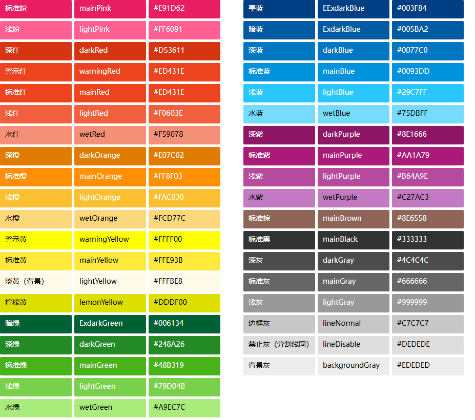

reuse.rule:
- pick standard color here first
- do not invent new project colors before checking token board

### base.tab1.a_buttons

source:
- `web/base.jsp:1330-1663`

ui.kind:
- old button kitchen sink

contains:
- `standard_color_buttons`
  - `btn-green`
  - `btn-lightGreen`
  - `btn-blue`
  - `btn-lightBlue`
  - `btn-ExdarkBlue`
  - `btn-warning`
  - `btn-lightOrange`
  - `btn-danger`
  - `btn-lightRed`
  - `btn-violet`
  - `btn-lightPurple`
  - `btn-grey`
  - `btn-cancle`
- `standard_size_buttons`
  - `btn-xs`
  - `btn-sm`
  - `default`
  - `btn-lg`
- `weak_buttons`
- `switch_group_buttons`
- `dropdown_buttons`
- `icon_buttons`
  - upload
  - download
  - export table
  - import table
  - view chart
  - print
  - add
  - rule setup
- `op_buttons`
  - submit
  - cancel
  - publish
- `return_buttons`
- `color_cycle_buttons`
- `tag_groups`
  - standard checked tags
  - closable tags
  - choose-all tags

evidence:
- 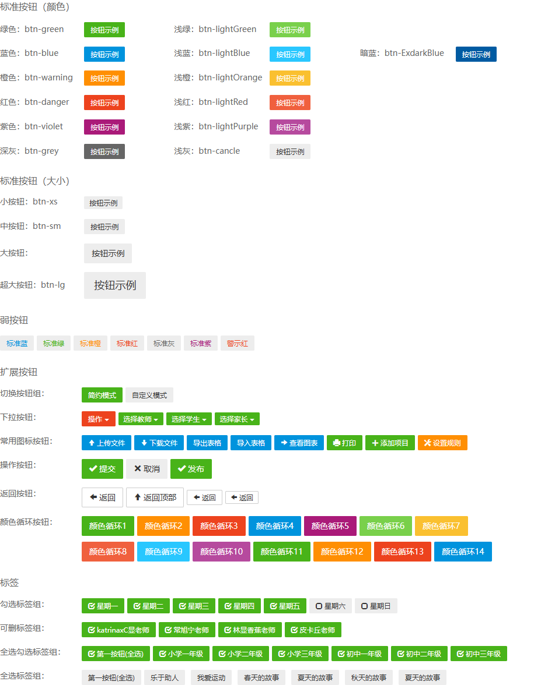
- 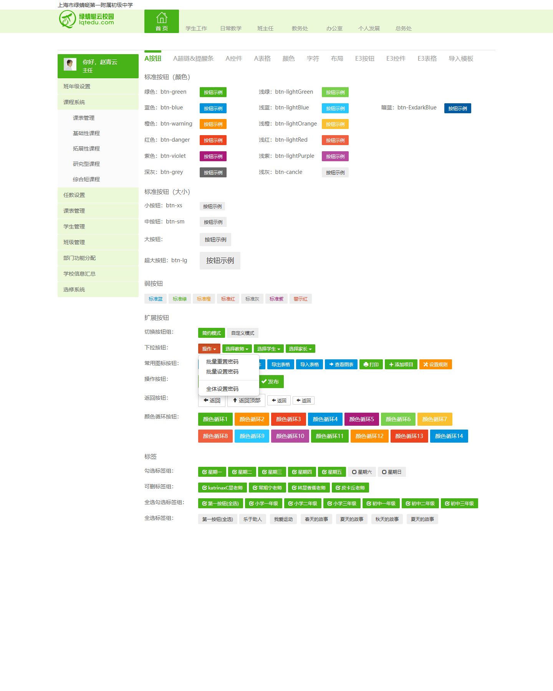

reuse.rule:
- old JSP button block: copy whole row/wrapper, not just single button
- dropdown buttons still rely on Bootstrap menu structure

### base.tab2.text

source:
- `web/base.jsp:1664-1696`

ui.kind:
- action text + icon strip

contains:
- delete
- edit
- settings
- reset password
- view
- enter space
- move up
- move down
- top move
- bottom move
- join
- remove
- arrange course
- download
- prompt icon
- search
- upload
- add
- confirm
- cancel
- selected

evidence:
- 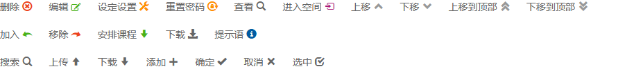

reuse.rule:
- use when page needs text-op row instead of normal buttons

### base.tab3.a_links_alerts

source:
- `web/base.jsp:1697-1811`

ui.kind:
- link palette + alert palette + popup entry area

contains:
- `color_links`
  - `a_green`
  - `a_danger`
  - `a_warning`
  - `a_blue`
- `alerts`
  - `alert-success`
  - `alert-info`
  - `alert-warning`
  - `alert-danger`
- `general_modal` (Bootstrap modal)
- `huge_dialog_entry`
- `huge_page_entry`
- `hovercard_entry`
- `hovercard.inner.table.like.data`

hidden.state.evidence:
- 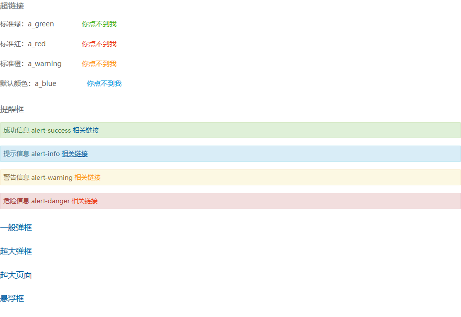
- 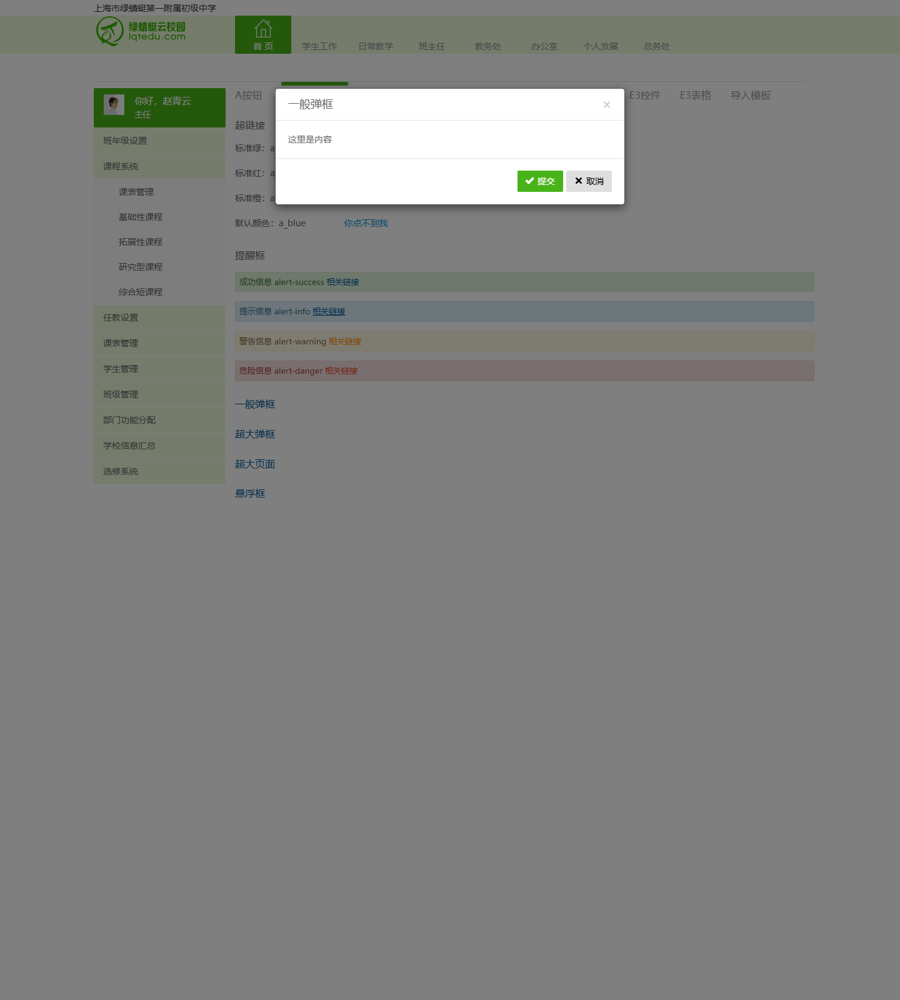
- 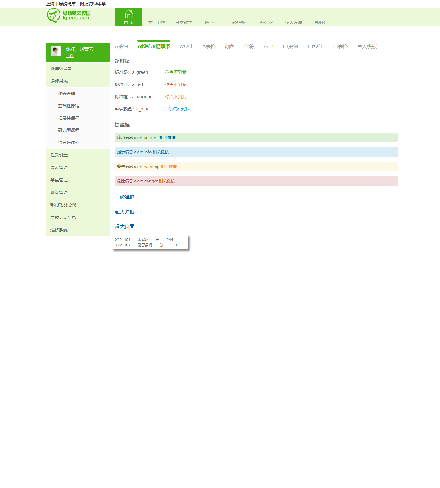

reuse.rule:
- old alert and text-link styles come here first
- if page already uses Bootstrap modal, follow this tab, not Element dialog

### base.tab4.a_controls

source:
- `web/base.jsp:1812-2235`

ui.kind:
- old form control warehouse

contains:
- `checkbox.vertical`
- `checkbox.horizontal`
- `radio.vertical`
- `radio.horizontal`
- `required_field_label`
- `inputs.width.100_to_10`
- `input.disabled`
- `textarea.maxlength.counter`
- `select.number`
- `select.standard`
- `select.week`
- `select.term`
- `select.grade`
- `select.grade_class.cascade`
- `file_input`
- `raty_score`
- `search_input_with_enter`
- `date_range`
- `date_range.term_less`
- `datetime_range`
- `iframe_image_upload = /base-uploadPic.jsp`
- `uploadifive.file_hook`
- `uploadifive.excel_hook`

evidence:
- 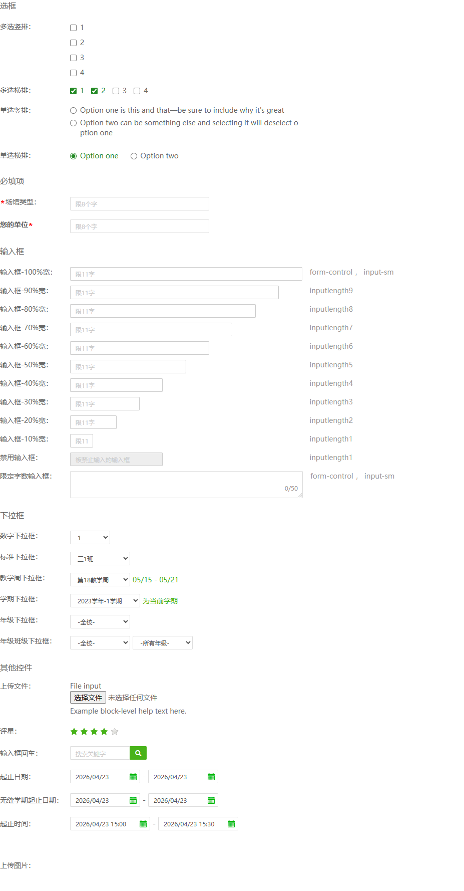

reuse.rule:
- old date input with green calendar icon = usually `WdatePicker`
- old upload path often = `file input` or `uploadifive` or iframe, not new component system

### base.tab5.a_tables

source:
- `web/base.jsp:2236-2504`

ui.kind:
- old table style warehouse

contains:
- `standard_table = table table1 table-bordered1 table-hover1 table-condensed`
- `double_column_table = table4col`
- `freeze_table = freeze-table freeze-table2`
- `paginationgreen`

evidence:
- 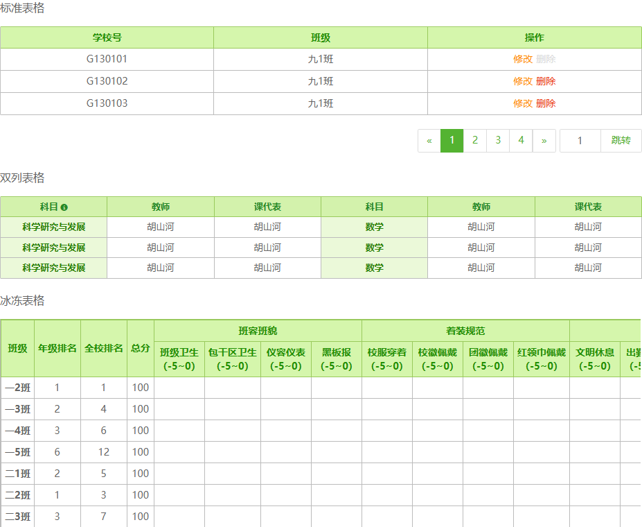

reuse.rule:
- old list page table style: copy class combo from here
- `table4col` and `freeze-table` are common old templates

### base.tab6.layout

source:
- `web/base.jsp:2505-2533`

ui.kind:
- layout primitives

contains:
- `title.level.1 = h4-title`
- `title.level.2 = h4-title-sm`
- `title.level.3 = div_title`
- `step_bar`
- `single_solid_divider`
- `single_dashed_divider`
- `double_dashed_divider`
- `huge_page_head_entry = /base-HugePageHeadCss.jsp`

evidence:
- 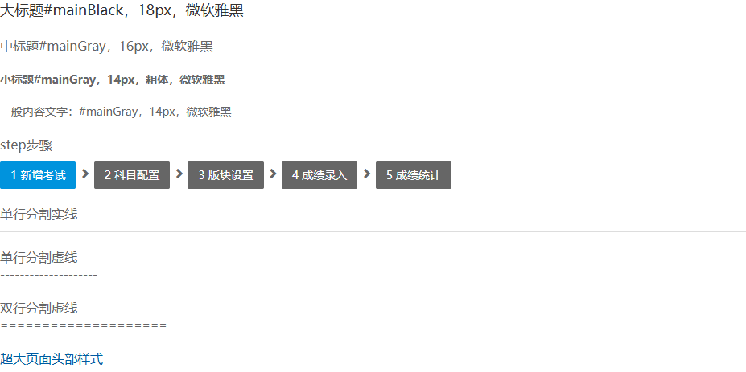

reuse.rule:
- title hierarchy and step UI for old page come here

---

## INVENTORY.ebase

### ebase.tab10.e3_buttons

source:
- `web/ebase.jsp:858-1329`

ui.kind:
- Element Plus based action-area kit

contains:
- `top_link_strip`
  - edit
  - fill
  - config
  - cancel
  - clear student
  - remove
  - preview
  - download
  - generate
  - save
  - memo
  - add
- `standard_color_buttons`
- `standard_size_buttons`
- `weak_buttons`
- `switch_group_buttons = el-radio-button`
- `dropdown_buttons`
- `icon_buttons`
- `op_buttons`
- `return_buttons`
- `color_cycle_buttons`
- `search_input_with_append_button`
- `tag_groups`
  - standard tags
  - closable tags
  - choose-all tags

evidence:
- 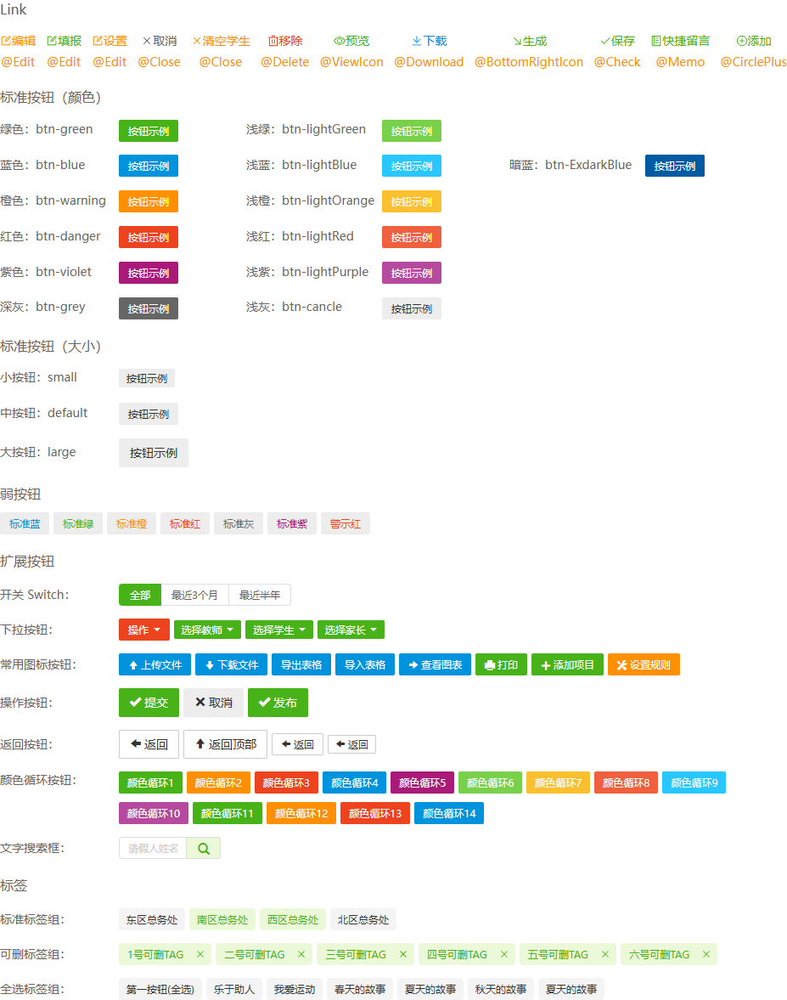

reuse.rule:
- E3 toolbar/action area: copy whole section, not isolated button only
- keep local class names + Element wrappers together

### ebase.tab7.e3_controls

source:
- `web/ebase.jsp:310-533`

ui.kind:
- Element Plus form controls under local E3 skin

contains:
- `select.w80`
- `select.w120`
- `select.w140`
- `date_picker.date`
- `date_picker.datetime`
- `date_picker.daterange`
- `grade_class_cascade`
- `checkbox_group`
- `radio_group`
- `upload.picture_card`
- `image_preview_dialog`
- `upload.file.blue_large_button`
- `upload_success_alert`
- `upload_success_primary_link`
- `huge_dialog_trigger`
- `huge_dialog.inner_table`

evidence:
- 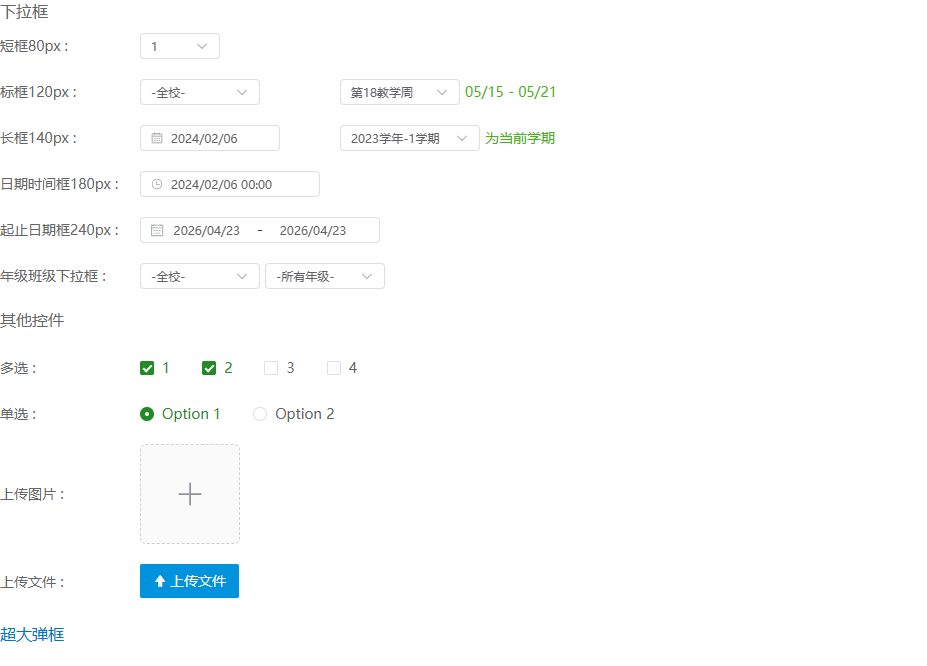
- 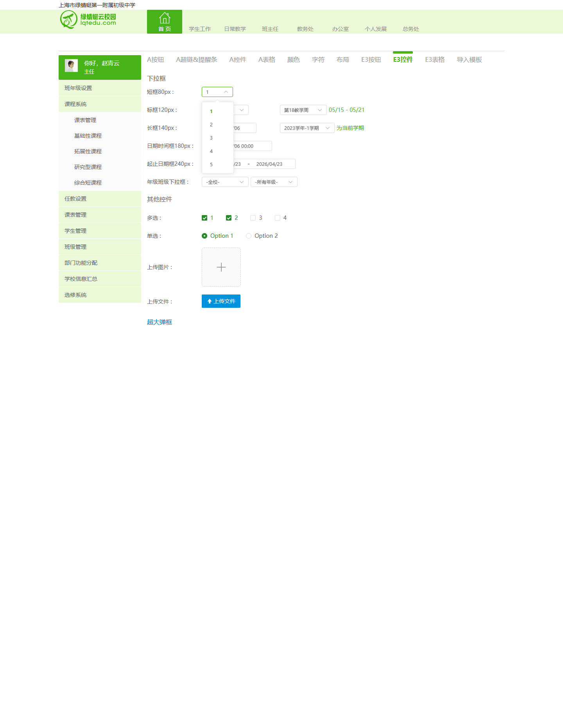
- 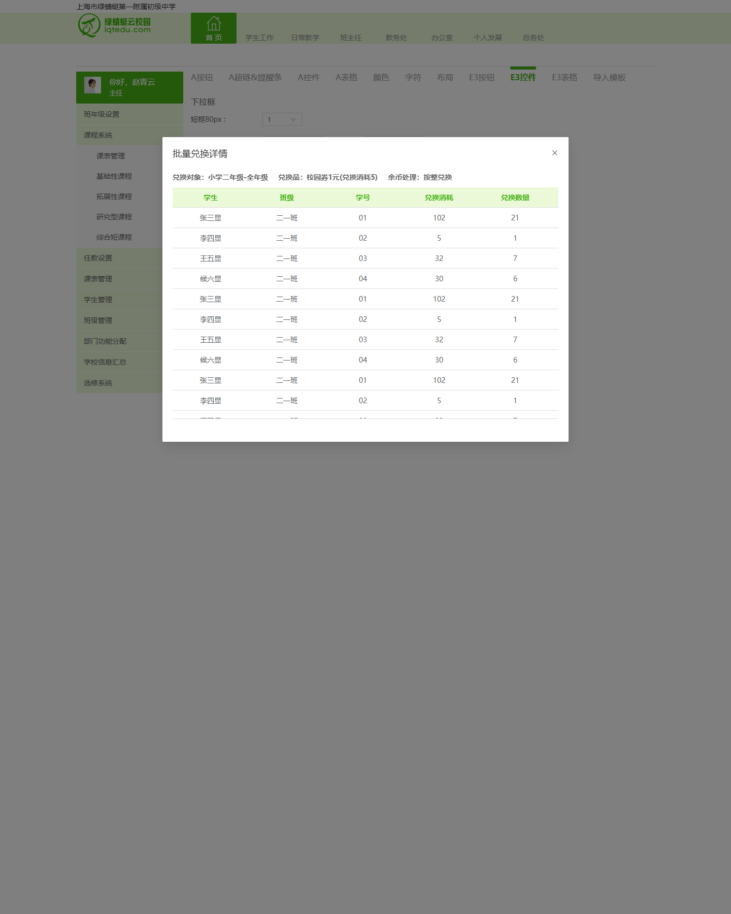

reuse.rule:
- keep `E3-control-item` wrapper
- keep local width classes / local button type / local link type
- do not replace with raw Element default theme

### ebase.tab8.e3_tables

source:
- `web/ebase.jsp:534-857`

ui.kind:
- E3 list/config/table page pattern

zones:
- `zone.A.config_toolbar_and_switch_table`
  - top `el-radio-button` switch: `FILL / REPORT`
  - batch action buttons
  - fill mode config table
  - report mode config table
  - `el-switch`
  - `el-empty`
  - `el-pagination`
- `zone.B.filter_toolbar_and_leave_list`
  - term select
  - grade select
  - class select
  - search buttons
  - date range
  - batch remind
  - leave list table
  - status filter column
  - operation links: view / remind
  - empty state
- `zone.C.detail_config_table`
  - long horizontal table
  - fixed left column
  - required marker cell
  - target / reviewer / implement columns
  - pagination
  - report-mode tail table repeated at bottom when switched

evidence:
- 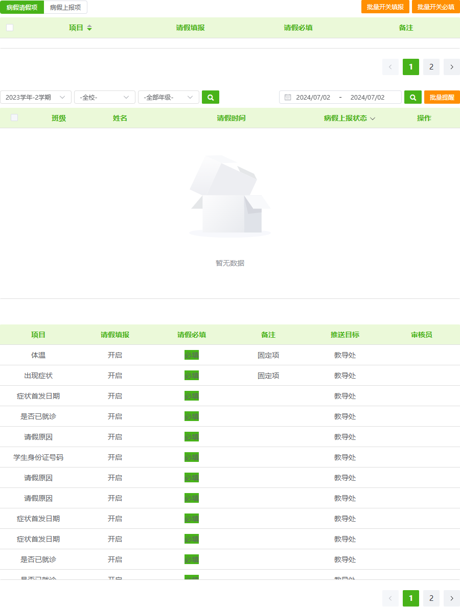
- 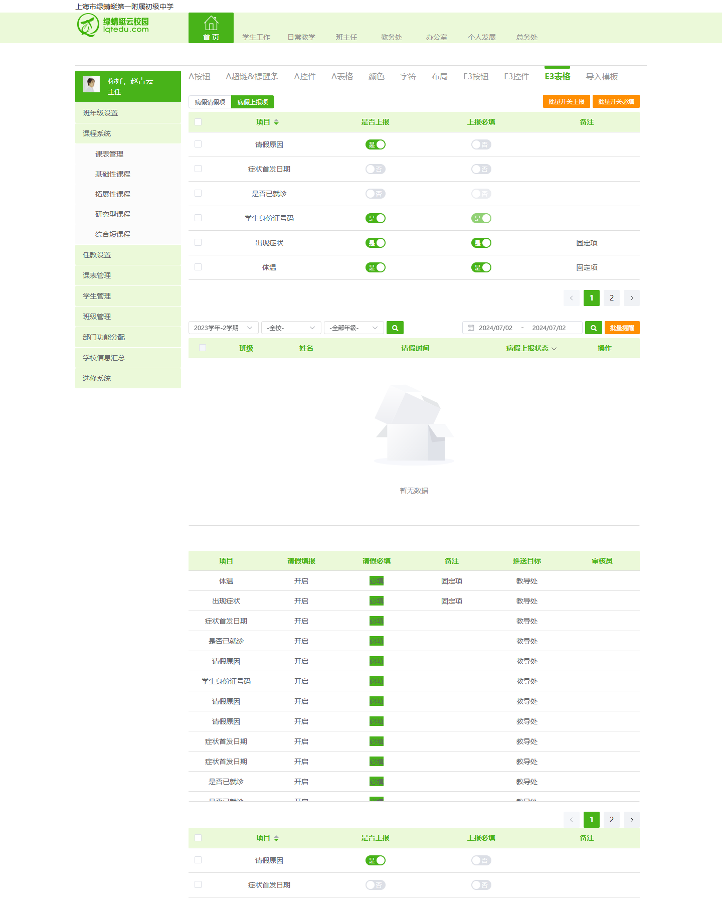

reuse.rule:
- E3 list page usually = toolbar + main table + detail/config table
- do not copy only `el-table`; copy search bar, empty state, pagination, op links together

---

## HIDDEN_STATE_INDEX

base.hidden.states:
- `A超链&提醒条.general_modal.open = verified`
- `A超链&提醒条.hovercard.open = verified`

ebase.hidden.states:
- `E3控件.select_dropdown.open = verified`
- `E3控件.huge_dialog.open = verified`
- `E3控件.image_preview_dialog = source verified`
- `E3控件.upload_success_alert = source verified`
- `E3表格.report_mode = verified`

---

## CHECKLIST

checked.items:
- `[x] base.tab0`
- `[x] base.tab1`
- `[x] base.tab2`
- `[x] base.tab3`
- `[x] base.tab3.modal_open`
- `[x] base.tab3.hover_open`
- `[x] base.tab4`
- `[x] base.tab5`
- `[x] base.tab6`
- `[x] ebase.tab7`
- `[x] ebase.tab7.select_open`
- `[x] ebase.tab7.dialog_open`
- `[x] ebase.tab8.fill_mode`
- `[x] ebase.tab8.report_mode`
- `[x] ebase.tab10`
- `[x] redirect.tab9`
- `[x] source_to_ui_match`
- `[x] style_source_match`

final.assert:
- within `base.jsp` + `ebase.jsp` page scope, no component family missing from current map

---

## FAST_LOOKUP

lookup.rules:
- old JSP + direct DOM copy -> search `base.tab*`
- Vue/Element/E3 page -> search `ebase.tab*`
- need color token -> `base.tab0` + `lqt_color.css`
- need old width class -> `style.css:147/155/163/171`
- need old link class -> `Ava-a.css`
- need E3 button/link type skin -> `vue_config.css:122/158/186/192`
- need old table style -> `base.tab5`
- need E3 search/list page -> `ebase.tab8`
